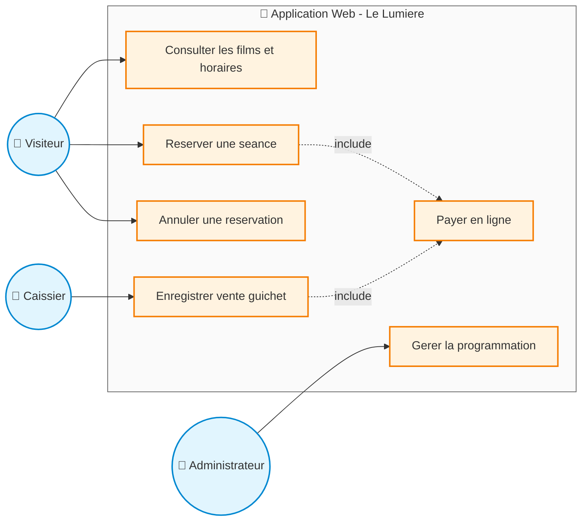

```mermaid
graph LR
    %% Déclaration des Acteurs
    Visiteur((👤 Visiteur))
    Caissier((👤 Caissier))
    Admin((👤 Administrateur))

    subgraph Systeme [🍿 Application Web - Le Lumiere]
        UC1[Consulter les films et horaires]
        UC2[Reserver une seance]
        UC3[Payer en ligne]
        UC4[Enregistrer vente guichet]
        UC5[Gerer la programmation]
        UC6[Annuler une reservation]
    end

    %% Liaisons Acteurs <=> Cas d'utilisation
    Visiteur --> UC1
    Visiteur --> UC2
    Visiteur --> UC6

    Caissier --> UC4

    Admin --> UC5

    %% Relations d'inclusion (include)
    UC2 -.->|include| UC3
    UC4 -.->|include| UC3

    %% Styles Industriels de soute - [RÉPARÉ V4] Purge des espaces sensibles
    classDef acteur fill:#e1f5fe,stroke:#0288d1,stroke-width:2px;
    classDef uc fill:#fff3e0,stroke:#f57c00,stroke-width:2px;
    style Systeme fill:#fafafa,stroke:#616161,stroke-width:1px;

    class Visiteur,Caissier,Admin acteur;
    class UC1,UC2,UC3,UC4,UC5,UC6 uc;
```
