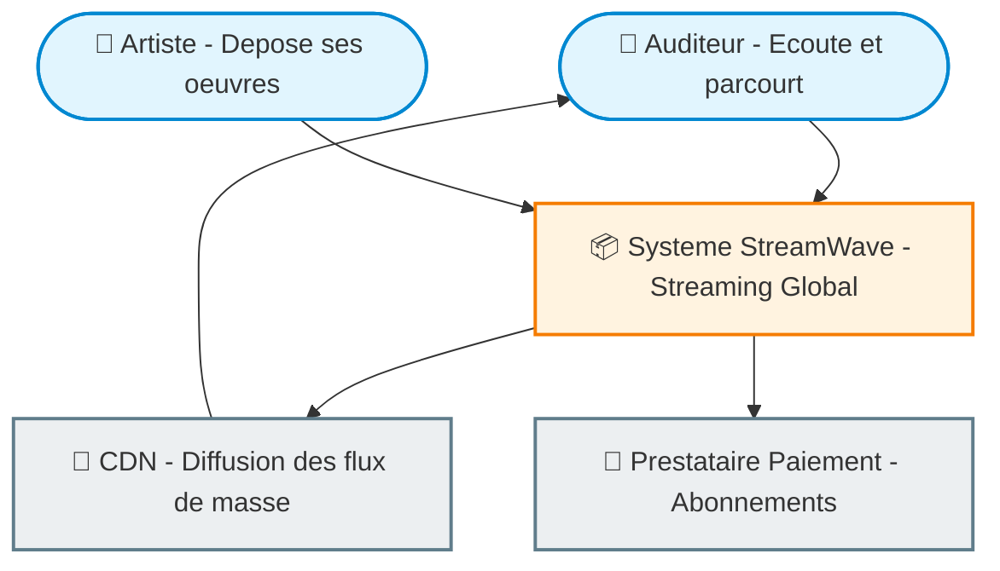

```mermaid
graph TB
    %% Déclaration des boîtes avec textes sans guillemets ni parenthèses internes
    Auditeur([👤 Auditeur - Ecoute et parcourt])
    Artiste([👤 Artiste - Depose ses oeuvres])
    StreamWave[📦 Systeme StreamWave - Streaming Global]
    CDN[🔌 CDN - Diffusion des flux de masse]
    Paiement[🔌 Prestataire Paiement - Abonnements]

    %% Relations nominales simplifiées
    Auditeur --> StreamWave
    Artiste --> StreamWave
    StreamWave --> CDN
    StreamWave --> Paiement
    CDN --> Auditeur

    %% Styles Métallurgiques d'écurie
    classDef acteur fill:#e1f5fe,stroke:#0288d1,stroke-width:2px;
    classDef systeme fill:#fff3e0,stroke:#f57c00,stroke-width:2px;
    classDef externe fill:#eceff1,stroke:#607d8b,stroke-width:2px;

    class Auditeur,Artiste acteur;
    class StreamWave systeme;
    class CDN,Paiement externe;
```
