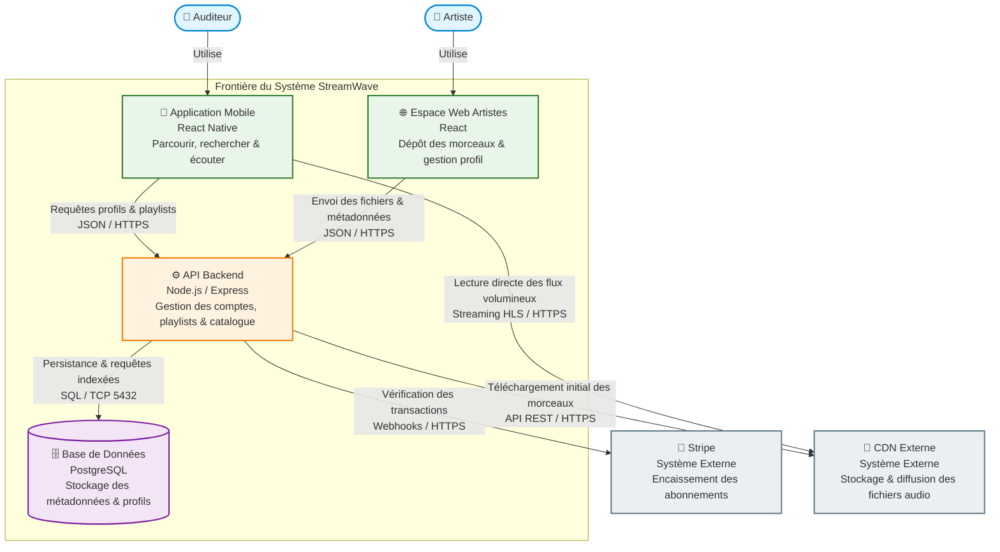

```mermaid
graph TB
    %% Frontières du Système développé
    subgraph Forteresse StreamWave [Frontière du Système StreamWave]
        AppMobile[📱 Application Mobile<br/>React Native<br/>Parcourir, rechercher & écouter]
        EspaceWeb[🌐 Espace Web Artistes<br/>React<br/>Dépôt des morceaux & gestion profil]
        API[⚙️ API Backend<br/>Node.js / Express<br/>Gestion des comptes, playlists & catalogue]
        BDD[(🗄️ Base de Données<br/>PostgreSQL<br/>Stockage des métadonnées & profils)]
    end

    %% Acteurs et Externes
    Auditeur([👤 Auditeur])
    Artiste([👤 Artiste])
    Stripe[🔌 Stripe<br/>Système Externe<br/>Encaissement des abonnements]
    AudioCDN[🔌 CDN Externe<br/>Système Externe<br/>Stockage & diffusion des fichiers audio]

    %% Flux physiques et Protocoles Réseau
    Auditeur -->|Utilise| AppMobile
    Artiste -->|Utilise| EspaceWeb

    AppMobile -->|Requêtes profils & playlists<br/>JSON / HTTPS| API
    EspaceWeb -->|Envoi des fichiers & métadonnées<br/>JSON / HTTPS| API

    API -->|Persistance & requêtes indexées<br/>SQL / TCP 5432| BDD
    API -->|Téléchargement initial des morceaux<br/>API REST / HTTPS| AudioCDN

    AppMobile -->|Lecture directe des flux volumineux<br/>Streaming HLS / HTTPS| AudioCDN
    API -->|Vérification des transactions<br/>Webhooks / HTTPS| Stripe

    %% Styles Métallurgiques
    classDef acteur fill:#e1f5fe,stroke:#0288d1,stroke-width:2px;
    classDef frontend fill:#e8f5e9,stroke:#2e7d32,stroke-width:2px;
    classDef backend fill:#fff3e0,stroke:#f57c00,stroke-width:2px;
    classDef db fill:#f3e5f5,stroke:#7b1fa2,stroke-width:2px;
    classDef externe fill:#eceff1,stroke:#607d8b,stroke-width:2px;

    class Auditeur,Artiste acteur;
    class AppMobile,EspaceWeb frontend;
    class API backend;
    class BDD db;
    class Stripe,AudioCDN externe;
```