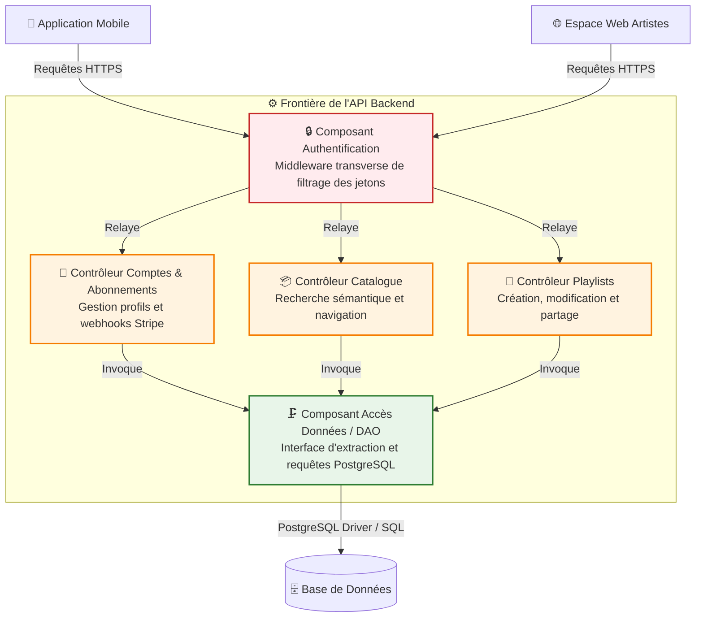

```mermaid
graph TB
    subgraph ConteneurAPI [⚙️ Frontière de l'API Backend]
        AuthMiddleware[🔒 Composant Authentification<br/>Middleware transverse de filtrage des jetons]
        CompteCtrl[👥 Contrôleur Comptes & Abonnements<br/>Gestion profils et webhooks Stripe]
        CatalogueCtrl[📦 Contrôleur Catalogue<br/>Recherche sémantique et navigation]
        PlaylistCtrl[🎵 Contrôleur Playlists<br/>Création, modification et partage]
        DAO[🗜️ Composant Accès Données / DAO<br/>Interface d'extraction et requêtes PostgreSQL]
    end

    %% Connexions Frontières (Niveau 2)
    App[📱 Application Mobile] -->|Requêtes HTTPS| AuthMiddleware
    Web[🌐 Espace Web Artistes] -->|Requêtes HTTPS| AuthMiddleware

    %% Aiguillage Interne du Pipeline Express
    AuthMiddleware -->|Relaye| CompteCtrl
    AuthMiddleware -->|Relaye| CatalogueCtrl
    AuthMiddleware -->|Relaye| PlaylistCtrl

    %% Raccordement unique au DAO
    CompteCtrl -->|Invoque| DAO
    CatalogueCtrl -->|Invoque| DAO
    PlaylistCtrl -->|Invoque| DAO

    %% Sortie vers les conteneurs de soute basse
    DAO -->|PostgreSQL Driver / SQL| BDD[(🗄️ Base de Données)]

    %% Styles Métallurgiques
    classDef middleware fill:#ffebee,stroke:#c62828,stroke-width:2px;
    classDef composant fill:#fff3e0,stroke:#f57c00,stroke-width:2px;
    classDef dao fill:#e8f5e9,stroke:#2e7d32,stroke-width:2px;

    class AuthMiddleware middleware;
    class CompteCtrl,CatalogueCtrl,PlaylistCtrl composant;
    class DAO dao;
```